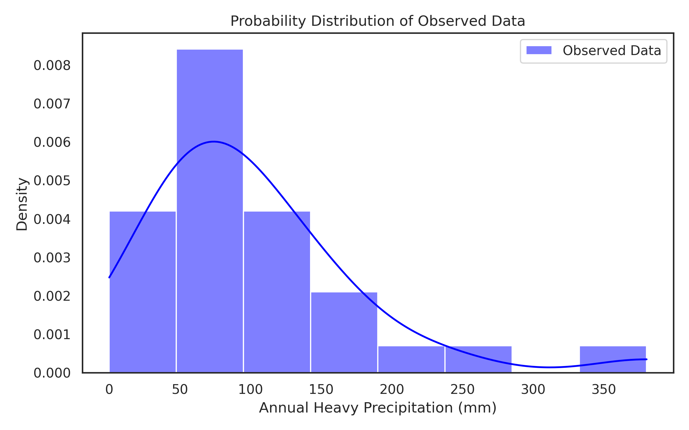
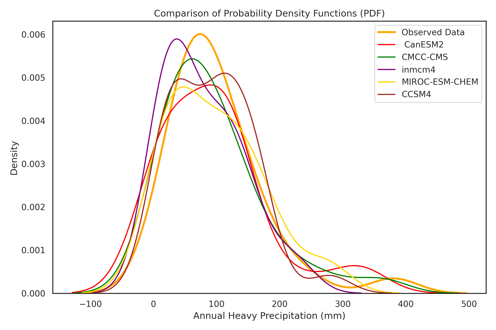
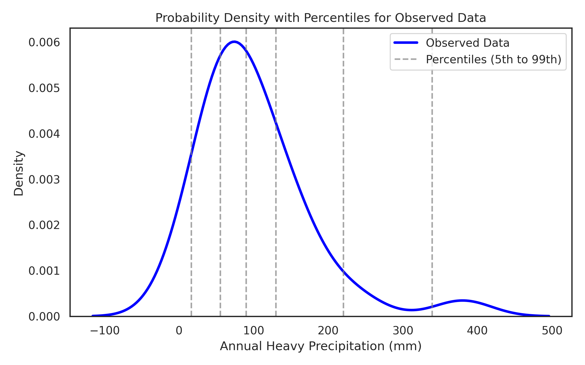
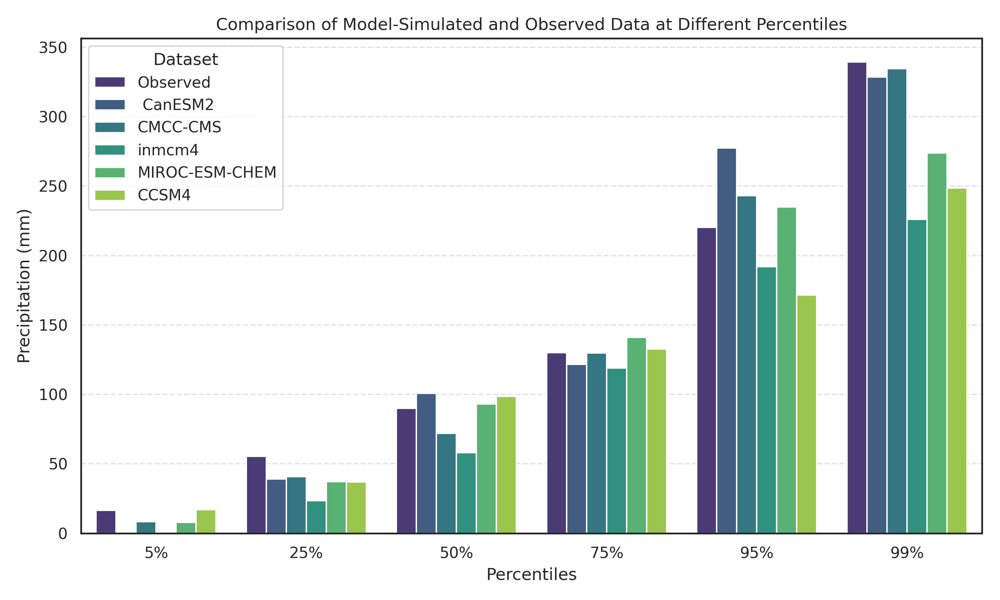

# Climate Impact Analysis on Reservoir Inflows

**Author:** Zoha Mustafa  
**Registration #:** 390621  

---

## Project Overview

Extreme climate events directly influence hydrological cycles and water infrastructure management. This repository focuses on validating global climate models and analyzing precipitation patterns to assess their broader impacts on reservoir inflows and water availability in Pakistan.

Using observed historical precipitation data (`R95p_Uncertainty_R-02`), this project benchmarks five global climate models to evaluate their reliability across median and extreme rainfall thresholds:

* **CanESM2**
* **CMCC-CMS**
* **inmcm4**
* **MIROC-ESM-CHEM**
* **CCSM4**

---

## Analysis Tasks & Visualizations

### Task 1: Probability Distribution of Observed Data
A probability density function (PDF) was plotted for observed historical precipitation using a histogram overlaid with a Kernel Density Estimate (KDE) to establish baseline statistical characteristics.

---

### Task 2: Overlay PDFs of Climate Models
To identify model biases, individual probability density functions for each climate model were plotted against observed precipitation records.

---

### Task 3: Percentile Distribution Lines
Vertical reference lines were mapped at key statistical percentiles (**5th, 25th, 50th, 75th, 95th, and 99th**) on the observed dataset to isolate dry, average, and extreme high-precipitation conditions.

---

### Task 4: Quantitative Percentile Comparison
The table below compares precipitation values (in mm) between observed historical data and climate model simulations across key percentiles:

| Percentile | Observed (mm) | CanESM2 | CMCC-CMS | inmcm4 | MIROC-ESM-CHEM | CCSM4 |
| :---: | :---: | :---: | :---: | :---: | :---: | :---: |
| **5%** | 16.39 | 0.00 | 8.42 | 0.00 | 7.83 | 17.00 |
| **25%** | 55.35 | 39.03 | 40.80 | 23.58 | 37.25 | 36.95 |
| **50%** | 89.95 | 100.80 | 71.95 | 58.10 | 93.05 | 98.55 |
| **75%** | 130.00 | 121.75 | 129.88 | 119.03 | 141.18 | 132.65 |
| **95%** | 220.34 | 277.49 | 243.00 | 192.09 | 234.86 | 171.59 |
| **99%** | 339.43 | 328.50 | 334.66 | 226.14 | 273.77 | 248.68 |

 

---

## Findings & Key Takeaways

1. **Lower Percentiles (5th–25th):** CanESM2 and inmcm4 fail to capture low-end precipitation totals, underestimating values down to 0.00 mm at the 5th percentile.
2. **Extreme Highs (95th–99th):** CanESM2 and CMCC-CMS consistently overestimate heavy rainfall events, which could lead to overestimating flood risk in reservoir inflow planning.
3. **Best Overall Performer:** MIROC-ESM-CHEM aligns most accurately with actual observed data across both central trends and extreme precipitation levels, making it the most reliable input for hydrological modeling in this context.
